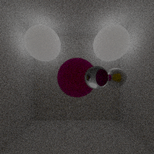

> Le rapport au format PDF est diponible dans l'onglet **Actions** > **Workflows** > **Docs to PDF**. Sélectionner ensuite le dernier *job* exécuté et télécharger le dossier `report` dans la catégorie **Artefacts**.

> **_Le rapport est une version PDF du README.md, si cela est possible, il sera préférable de lire directement le README.md. De plus les images ne s'affichent pas dans le rapport au format PDF pour une raison qui m'est inconnue_**

# Informatique Graphique

> AdrKacz (@AdrKacz), ECL, MOS 2.2, Informatique Graphique, Nicolas Bonneel (@nbonneel)

> Le code ci-dessous sera tout le temps, sauf indiqué, du pseudo-code, pour faciliter la lecture

Réalisation d'un *raytracer* en **C++** avec les options suivantes:
- Sphère
- Source de lumière ponctuelle
    - Éclairage direct
- *Multi-threading* (réduction du temps de calcul)
- Matériaux opaque avec une couleur
- Matériaux réfléchissants
- Matériaux transparents
- *Anti-aliasing*
- Source de lumière sphérique
    - Éclairage indirect
- Profondeur de champ
- *Mesh*
    - Boîte englobante (réduction du temps de calcul)
    - ~~*Bounding Volume Hierarchy*(réduction du temps de calcul)~~
- Déplacement dans l'espace

# Comment exécuter le code ?

> Le compilateur doit supporter l'option *-fopenmp* pour pouvoir utiliser *PRAGMA*

```sh
make && ./InformatiqueGraphique && make clean
```

> Mon ordinateur ne supporte pas l'option `-fopenmp`.

## Utilisation d'une machine de Centrale Lyon

 J'ai pu travailler sur une machine en **SSH** de l'École Centrale de Lyon.

# Création de l'image

```
FOR X in image widht
    FOR Y in image height
        U = Vecteur normalisé FROM Origin TO X,Y
        COLOR = couleur dans l'environment à U
        image[X, Y] = COLOR
```

# Création d'une sphère

Pour créer une sphère, il suffit de lui ajouter un rayon et une origine. Je calcule ensuite l'intersection entre un `rayon` potentiel et la sphère et renvoie :
- la normale au point d'intersection
- le point d'intersection 
- la distance avec l'intersection.

# Création d'une source de lumière ponctuelle

```
GET_COLOR (POINT):
    IF (la droite entre POINT et LIGHT n'intersecte rien)
        COLOR = couleur de POINT en fonction de LIGHT
    ELSE
        COLOR = noir
```

<p float="left" align="middle">
    
</p>

# Réduction du temps de calcul avec le *multi-threading*

## Avec <thread>

Le calcul précédent a pris **233.621ms**.

J'ajoute donc des *threads* avec la *library* `thread`.

Je divise donc l'image en une grille et assigne à chaque *thread* une cellule.

```
FOR C in colonnes
    FOR L in lignes
        nouveau thread at CELL C,L
WAIT FOR ALL threads
```

Le temps de calcul, pour la même image, passe à **54.0334ms** soit une diminution du temps de calcul par **4**.

Pour illustrer la méthode, voici le résultat lorsque je n'effectue pas le calcul si `C = L`.

<p float="left" align="middle">
    
</p>

### Temps de calcul

> Réalisé pour une sphère dans une pièce composée de quatres autres sphères, sans aucune amélioration de rendu.

Calcul en parralèle | Temps de calcul
--  | --
Non | **233.621 ms**
Oui | **54.0334 ms**

## Avec Pragma

Cependant, cette méthode allourdie le code. En effet, il faut découper au préalable l'image, lancer chaque *thread* individuellement, puis attendre la fin de chaque *thread*.

Pour éviter de modifier le code, j'utile donc *PRAGMA* qui permet d'obtenir un résultat similaire en une instruction: `#pragma omp parallel for num_threads(OMP_NUM_THREADS) schedule(dynamic, 1)`

# Ajouts des matériaux

## Matériaux opaques

Les matériaux opaques rajoute la possibilté de définir un **albedo** qui est la couleur de l'objet.

```
GET COLOR (POINT): (vector)
    RETURN (vector)ALBEDO * (flottant)intensité à POINT
```

<p float="left" align="middle">
    
</p>

## Matériaux réfléchissants

Les matériaux réfléchissants renvoient les rayons lumineux reçus par le *raytracer*.

```
IF boule IS reflechissante
    R = rayon réfléchi à intersection avec de boule
    IF intersection I entre une boule et R
        RETURN GET_COLOR (I)
```

<p float="left" align="middle">
    
</p>

## Matériaux transparents

Les matériaux transparents laissent passer les rayons lumineux reçu par le *raytracer*.

Il faut bien distinguer les rayons entrant dans le matériau et les rayons sortant du matériau.

> Dans le code, `n` symbolise l'**indice de refraction**.

```
IF boule IS transparent
    IF rayon IS entrant
        N1 = n de air
        N2 = n de boule
    ELSE
        N1 = n de boule
        N2 = n de air

    T = rayon transmis en fonction de N1 / N2 à intersection avec boule 

    if intersection I entre boule et T
        RETURN GET_COLOR (I)
```

<p float="left" align="middle">
    
</p>

# Réduction du crénelage par *anti-aliasing*

Réduction du crénelage | Méthode
-- | --
Non | Envoyer **un rayon par pixel** pour obtenir sa couleur
Oui | Envoyer **n rayon par pixel** selon une **distribution normale** sur la surface du pixel


<p float="left" align="middle">
    
</p>

# Création d'une source de lumière sphérique

## Éclairage indirect

Ajouter de l'éclairage indirect consiste à prendre en compte les contributions des rayons ayant rebondis plusieurs fois sur d'autre surfaces avant d'éclairer la surface étudiée.

Ici, je simule le phénomène inverse : à chaque fois que j'intersecte avec une surface, je renvoie un nouveau rayon dans une direction aléatoire pour ajouter sa contribution. 

> Il faut penser à limiter le nombre maximum de rebond : `Environment::BOUNCES_MAX`

```
GET_COLOR (POINT, NOMBRE REBOND):
    IF NOMBRE REBONDS > Environment::BOUNCES_MAX:
        RETURN

    W = rayon aléatoire émis autour de intersection selon une loi uniforme
    IF intersection I avec une boule
        COLOR += GET_COLOR (I, NOMBRE REBOND + 1)
```

<p float="left" align="middle">
    
</p>

## Éclairage non ponctuelle

Jusqu'à présent, l'éclairage provenait d'un point dans l'espace. Maintenant que chaque object est éclairé par son environment, nous pouvons ajouter des boules qui émettent de la lumière.

Un rayon issu de l'éclairage indirect a une intensité positive lorsqu'il rébondit jusqu'à une boule émissive.

```
GET_COLOT (POINT):
    IF boule IS émissive
        RETURN lumière de la boule fonction de son albedo et de son intensité
```

<p float="left" align="middle">
    
</p>

Les chances d'arriver jusqu'à une boule émissive au hasard sont faibles, plusieurs pixels sont donc noires ce qui crée un bruit. Pour contrer ce problème, j'envoie deux rayons pour l'éclairage indirect :
- un dans une direction uniformément aléatoire *(le même que jusqu'à présent)* ;
- un dans la direction d'une boule émissive.

<p float="left" align="middle">
    
</p>

# Paramétrage de la profondeur de champ de la caméra

Pour simuler la profondeur de champ, je simule l'ouverture d'une caméra. Le rayon émis de la caméra ne provient plus d'un point fixe.

```
O = origine de la caméra
B = vecteur normalemment aléatoire
O += B

R = rayon issu du vecteur partant de O + B de longeur FOCAL DISTANCE en pointant dans la direction de la caméra
```

> Les deux images représentent la même scène, sans amélioration de rendu avec une source ponctuelle. L'image de **gauche** n'utilise pas de distance focal, l'image de **droite** à une **distance focal de 20 unité** *(distance entre la caméra et la boule transparente)*.

<p float="left" align="middle">
    
    
</p>

# Création de *mesh*

## Un triangle

<p float="left" align="middle">
    
</p>

## Un chien

<p float="left" align="middle">
    
</p>

## Réduction du temps de calcul avec une boîte englobante

> Tous les paramètres d'amélioration du rendu sont désactivés, il n'y a que de l'éclairage directe.

Utilisation de la *Bounding Box* | Temps de calcul
-- | --
Non | **40610 ms**
Oui | **11788 ms**

## ~~Réduction du temps de calcul avec un *Bounding Volume Hierarchy*~~

# Déplacement de la caméra dynamique dans l'espace


## Comment se déplacer

> Séquence utiliser pour la présentation : `zzzzzzddddddzzzzzzzzzqqqqqzzzzzzzzqqqqqsssss`

1. Lancer le programme comme précedement
2. Utiliser `zqsd` pour se déplacer
 - `z` : en avant
 - `s` : en arrière
 - `q` : tourner à gauche
 - `d` : tourner à droite
3. `ENTER` pour valider la suite de mouvements

Par exemple, si je souhaite faire deux pas en avant puis regarder à gaude de deux crans, je peux entrer : 

```
zzqq
```

# Les erreurs que j'ai rencontrées

**TODO: Détailler la correction**

**TODO: Ajouter erreur du triangle dédoublé**

## Intersection avec soi-même

Lorsque le rayon réfléchi est émis d'une surface, si je ne déplace pas l'object d'un petit **delta** en direction de la normale de l'object, le rayon à une forte de chance d'intersecter avec la surface initiale à cause de la discrétisation de l'espace.

<p float="left" align="middle">
    
</p>

## Éclairage indirect saturé

<p float="left" align="middle">
    
</p>

## Erreur de `type`

Lors du parcours des pixels selon `x` et `y` entre `0` et `width` ou `height` respectivement, j'ai utilisé le type `unsigned int` pour `x` et `y`.

Cependant, je soustrait une valeur (la moitié de la taille de l'écran) à `x` et `y` pour recentrer le rayon. Si `x` ou `y` sont trop faibles (inférieur à la moitié de la taille de l'écran), le calcul est négatif, hors un `unsigned int` ne peut pas l'être, ce qui résulte en la limite supérieur au type `unsigned int`.

Cela donne un rayon partant d'éexcessivement loin qui n'intersecte avec rien, d'où le découpage en carré uniforme noir ou gris (gris si dans une des sphères consituant les murs extérieurs).

Il suffit *(après trois heures d'incompréhension)* d'utiliser le type `int` pour supprimer l'erreur.

<p float="left" align="middle">
    
</p>

## Bounding Volume Hierarchy lacunaire

<p float="left" align="middle">
    
</p>

---

> Les informations ci-dessous ne sont plus à jour et ne font pas partie du rapport. Je les laisse à titre de *pense-bête* lors de mes futures utilisations de ce répertoire. 

# Notes
- [x] Calcul parallèle avec `<thread>`
    - Mesure de le différence de temps de calcul
- [X] Écrire le code dans plusieurs fichiers au lieu d'avoir un grand fichier

# BE1

## Objectif

- Image d'une sphère
- Source de lumière
- Boîte encapsulant la scène

## [Vector](src/Vector)

## [Ray](src/Ray)

## [Sphere](src/Sphere)

## [Environment](src/Environment)

## Main

```c++
int main(int argc, char* argv[]) {
	int W = 512;
	int H = 512;

    Environment E = Environment();
    E.add_sphere(Sphere(Vector(0, 0, 0), 10));

    E.add_sphere(Sphere(Vector(-10050, 0, 0), 10000));
    E.add_sphere(Sphere(Vector(+10050, 0, 0), 10000));
    E.add_sphere(Sphere(Vector(0, -10050, 0), 10000));
    E.add_sphere(Sphere(Vector(0, +10050, 0), 10000));
    E.add_sphere(Sphere(Vector(0, 0, -10050), 10000));
    E.add_sphere(Sphere(Vector(0, 0, +10050), 10000));

    E.add_light(Vector(30, 30, 25));
    // E.add_light(Vector(-20, -20, -15));
    

    Vector C = Vector(0, 0, 40);
    double alpha = 90 * M_PI / 180;
    double z = - W / (2 * tan(alpha / 2));
	
	std::vector<unsigned char> image(W*H * 3, 0);

    double rho = M_PI;
    double I = 5e6;

    auto start = std::chrono::high_resolution_clock::now();
	for (int i = 0; i < H; i++) {
		for (int j = 0; j < W; j++) {    
            Vector u = Vector(j - W / 2 + 0.5, H - i - H / 2 + 0.5, z);
            u.normalize();
            Ray r = Ray(C, u);

            Vector P, N;
            if (E.intersect(r, P, N))
            {
                double intensity = E.get_intensity(N, P, I, rho);
                intensity = clamp(intensity, 0., 255.);
                
                image[(i*W + j) * 3 + 0] = intensity;
			    image[(i*W + j) * 3 + 1] = intensity;
			    image[(i*W + j) * 3 + 2] = intensity;
            }
		}
	}
    auto end = std::chrono::high_resolution_clock::now();
    auto diff_sec = std::chrono::duration_cast<std::chrono::nanoseconds>(end - start);

    std::cout << "Temps pour la création de l'image: " << diff_sec.count() / 1000000.0 << "ms\n";

    std::string filename = "image";
    if (argc > 1) {
        filename = argv[1];
    }
    filename = "outputs/" + filename + ".png";
    stbi_write_png(filename.c_str(), W, H, 3, &image[0], 0);
	

	return 0;
}
```

## Résultat


> Temps pour la création de l'image: 233.621ms

## BE 1 - Extra

### Parallélisation

```c++
#include <thread>
#define NB_THREAD_GRID 4 // grid n * n > NB_THREAD = NB_THREAD_GRID * NB_THREAD_GRID
```

```c++
int main(int argc, char* argv[]) {
	// ...

    // Thread
    const int step = std::ceil(512 / NB_THREAD_GRID);
    std::thread threads[NB_THREAD_GRID * NB_THREAD_GRID];

    // ...
    for (int x = 0; x < NB_THREAD_GRID; x++)    
    {
        for (int y = 0; y < NB_THREAD_GRID; y++) {
            threads[NB_THREAD_GRID * x + y] = std::thread([x, y, &step, &z, &E, &W, &H, &C, &rho, &I, &image]()
            {
                // ...
            });
        }
    }
    
    for (int x = 0; x < NB_THREAD_GRID; x++)    
    {
        for (int y = 0; y < NB_THREAD_GRID; y++) {
            threads[x * NB_THREAD_GRID + y].join();
        }
    }
    // ...
}
```


> Temps pour la création de l'image: 54.0334ms

**Nous avons diviser le temps de calcul par environ `4.5`.**

Pour voir l'exécution des `thread`, nous annulons l'éxécution sur la diagonale.

```c++
if (x == y)
{
    continue;
}
```


> Temps pour la création de l'image: 41.6291ms

# BE 2

## Objectif

- Construire des ombres projetées
- Construire des matériaux réfléchissants
- Construire des matériaux transparents

## BE 2 - Extra

### Déplacement dans l'espace

```c++
int main(int argc, char* argv[]) {
    // ...
    std::string mvt_sequence = "";
    bool is_alive = true;
    char c = ' ';
    while (is_alive) {
            refresh(filename, threads, step, z, E, W, H, C, rho, I, I_pow_factor, image);
            std::cin >> c;
            switch (c)
            {
            case 'z':
                C.move_forward(1.);
                break;
            case 's':
                C.move_forward(-1.);
                break;
            case 'a':
                C.move_right(1.);
                break;
            case 'e':
                C.move_right(-1.);
                break;
            case 'q':
                C.rotate(- M_PI / 12);
                break;
            case 'd':
                C.rotate(+ M_PI / 12);
                break;
            default:
                is_alive = false;
                break;
            }
            mvt_sequence += c;
    }
    std::cout << "Movement Sequence:\n" << mvt_sequence;    
	
	return 0;
}
```

### Réflection totale dans les matériaux transparent (TODO)

# BE 3

> BRDF Databse: https://www.merl.com/brdf/
> Global Illumination Compendium: https://people.cs.kuleuven.be/~philip.dutre/GI/


128 rayons par pixels.


> Temps pour la création de l'image: 26219.4ms

Anti-aliasing avec Box-Muller, `sigma = 0.5`, `32 rayons`.


> Temps pour la création de l'image: 6749.88.4ms

# BE 4 (absent)


> Temps pour la création de l'image: 3922.12ms


> Temps pour la création de l'image: 4106.09ms


> Temps pour la création de l'image: 8059.9ms


> Temps pour la création de l'image: 20706.6ms


> Temps pour la création de l'image: 8310.03ms



> Temps pour la création de l'image: 8540.31ms

*__QUESTION__ : Avec intensity de la lumière a 1e8, les sphéres emissives sont __GRISES__... est-ce dû à la reflection partielle qui ne devrait pas être prise en compte sur une lampe? (voir exemple au dessus)*

*__QUESTION__ : Quel paramètre prendre pour une diffraction correcte ? (essaie fait sans l'indirect lighting : explosion de point)*


# BE 5 - Maillage


> Temps pour la création de l'image: 159.27ms